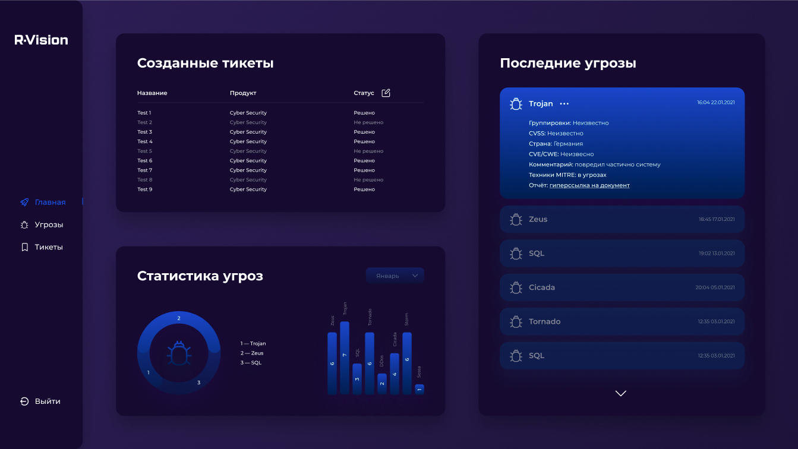

# Проект команды SecurityBand

## Инструкция по запуску:

git clone https://github.com/Kezhich/genesis; cd genesis

node app.js

http://localhost:3000/form - Форма загрузки аналитических отчетов (.txt)

http://localhost:3000/get_json - Результат анализа отчета в виде json

## Суть, TLDR

CVE парсим по регулярке CVE-\d{4}-\d{4,7}

CWE парсим по регулярке CWE-\d{1,4}

APT парсим по регулярке APT\d{1,4}

CVSS парсим по регулярке CVSS \d{1,2}\.\d{1}

Техники MITRE парсим заранее и собираем пересечения с аналитическими отчетами об угрозах, как и список стран.

Список названий ПО: парсим все существующие CVE за всё время с https://github.com/CVEProject/cvelist, собираем "product_name", т.е. продукт к которым они относятся, и собираем всё это без повторений во множество SOFTWARE. Теперь у нас есть названия программ/сервисов/etc и мы можем из отчётов парсить названия продуктов, которых эти отчёты касаются.

Создание тикетов. Админ может создать тикет по конкретной угрозе в дашборде, если считает её актуальной и необходимой к исправлению.

[Дашборд](https://www.figma.com/file/dum2HGsGc6yuMq4pPRajh4/R-Vision?node-id=3%3A329)

## Навигация по файлам

[parse.py](parse.py) - программа на питоне, на вход - отчет в input.txt, на выход - собранная из него информация (CVE/CWE, страны активности угрозы, техники MITRE, даты, причастные APT группировки). 

[app.js](app.js) - сам сервер на nodejs, связывающий сайт с питоном

[packages](packages) - фронт

[node_modules](node_modules) - модули ноды

[input_for_test_upload](input_for_test_upload) - тестовые аналитические отчеты для загрузки

[etroynov_genesis](etroynov_genesis) - связь бэка с фронтом

[codeql-analysis.yml](.github/workflows/codeql-analysis.yml) - тестирование безопасности проекта на SAST CodeQL
